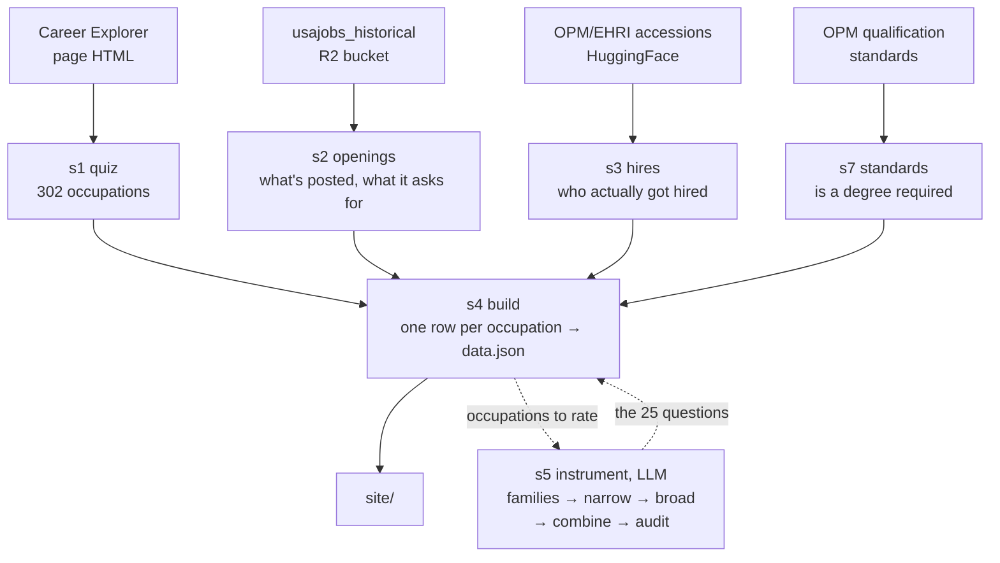

# Entry-level federal career quiz

A rebuild of the USAJOBS Career Explorer, aimed at entry-level hiring. Answer 25
questions about the kind of work you'd want, get federal occupations ranked by
fit — each one showing how many people it hired at entry level last year, how
many of those jobs are open to the public now, and what you'd need to qualify.

Everything on a card is about entry-level hiring: grades 01–09 on GS-style pay
plans, plus wage-grade trades.

Live at [usajobs-career-explorer.abigailhaddad.com](https://usajobs-career-explorer.abigailhaddad.com).

Not affiliated with USAJOBS or OPM. The official tool is at
[usajobs.gov/careerexplorer](https://www.usajobs.gov/careerexplorer/).

## Run it

```bash
python run.py        # fetch and rebuild the data; writes data/CHANGES.md
python run.py --full # the above, plus rebuild the questions, then rebuild the site
python serve.py      # open the quiz at http://localhost:8899
```

`--full` runs stages `1,2,3,7,4,5,4`. Stage 4 appears twice on purpose: stage 5
rates occupations from `series_facts`, which stage 4 builds, and stage 4 writes
the site payload from the questions, which stage 5 builds. Running stage 5
against a stale `series_facts` rated 86 of 302 occupations on job titles the
site no longer showed, and every stage still reported success, so stage 5 now
refuses to start when `series_facts` is older than its inputs.

Only stage 5 calls an LLM, which is why the plain `python run.py` leaves the
questions alone. Responses are cached in `data/.llm_cache`.

Two things live outside the repo. Stage 7 reads OPM's qualification standards
from a checkout of [opm-educ-req](https://github.com/abigailhaddad/opm-educ-req),
expected beside this repo — set `OPM_STANDARDS_CACHE` if it's elsewhere. Stage 5
needs `OPENAI_API_KEY`, from the environment or from a `.env` file.

## The pipeline



A failed stage keeps its previous output and the run exits non-zero, with
`CHANGES.md` naming the stale tables. Otherwise a broken fetch reads as "no
changes" and nothing looks wrong.

## How the scoring works

Everything runs in the browser. The page carries the 25 questions and, for each
of 302 occupations, 25 ratings saying how central each kind of work is to that
job. Your answers become 25 numbers too, and occupations get ranked by how
closely related your answers and their ratings are.

The 302 occupations come from the official tool. They cover 93% of federal
hiring since 2021, but hardly any Pathways hiring: most student and intern hires
land in occupations the official tool never rated, so this one can't rank them
either.

## What's on a card

**Hires** are OPM/EHRI accessions from 2021 on, counted as permanent hires at
entry grade — permanent meaning tenure groups 1 and 2. Banded pay plans are left
out of that count, because on those a low band number means senior, not junior.

**Postings** come from the `usajobs_historical` R2 bucket, counting only
announcements the public, students, or recent graduates can apply to. The count
is of announcements, not of the openings they claim to carry: `totalOpenings` is
missing or defaulted to 1 for 40% of series, and reads as high as 55 openings per
announcement elsewhere, so it is not solid enough to show anyone.

**Whether you need a degree** combines four sources — posting text, OPM's
published standard, what entry hires held, what hires at any grade held — since
none of them is reliable alone. That gives 88 occupations needing a degree, 209
not, 4 needing a credential, 1 unknown. The credential category exists for
practical nurses: only 9% hold a bachelor's, so the data says no degree needed,
but you can't do the job without an LPN diploma.

[METHODOLOGY.md](METHODOLOGY.md) has the rest: the real prompts, a real model
response, sample rows from every stage, and the scoring code.

## Writing the questions

The questions only help if occupations are rated differently on them. Two jobs
rated nearly the same across all 25 questions get nearly the same match score no
matter what you answer, so they always come up together and the quiz can't tell
you which one suits you better.

The official questions leave a lot of jobs in that state. Across the 175
occupations doing most of the entry-level hiring, those 32 questions put the
biggest hirers at 0.17 average similarity to each other, and ten pairs come out
interchangeable:

| pair | similarity |
|---|---|
| Criminal investigating / Customs and border protection | 0.98 |
| Correctional officer / Police | 0.83 |
| Nursing assistant / Practical nurse | 0.81 |

Nursing assistant and practical nurse hire about the same number of people, and
one of them needs an LPN diploma. Someone deciding between the two would want the
quiz to tell them apart, and it can't.

Stage 5 writes its own questions, and scores them the same way: rate every
occupation 0 to 4 on every question, then compare the 30 biggest hirers to each
other and average how alike they come out. A lower number means the questions
pull jobs apart.

Average similarity is the wrong thing to optimise, though. Some occupations
really are alike — nursing assistant and practical nurse hire about the same
number of people and do much the same work — and a quiz claiming to separate
them on interest alone is lying. The defect is a tie between occupations whose
postings describe different work, so `tie_audit.py` compares every tied pair
against its posting text and only those count. The shipped set has 10 ties among
the biggest hirers and 2 of them are defects, against 4 for the set it
replaces.

That number can improve while the quiz gets worse. A 6-question version scored
better than the 21-question one, because fewer questions give occupations less
to differ on. It also gave thousands of simulated quiz-takers only 32 different
top matches between them — it separated the occupations without giving different
people different results.

Variety is checked separately, as pass or fail: simulate 3,000 takers, count
how many occupations turn up as someone's top match, and reject any question set
that loses more than 5% of that. This started out as part of the score, weighted
against separation, and the scoring kept preferring question sets that gave up
variety to get a better similarity number.

The rest is pruning and retries. Drop questions that nearly every occupation
gets the same rating on, and drop one of any two questions that measure the same
thing. Generate three separate sets and keep whichever scores best, since asking
the model for questions gives different results each time, while re-rating the
same questions is stable. Then send the pairs that are still tied back to the
model, asking for questions that would split those specific pairs, and keep that
round only if the score improves.

The site ends up with 25 questions, 18 specific and 7 broad. The specific ones
separate the big hirers; broad ones cover kinds of work the specific items miss.
Broad questions push the similarity number back up, because more occupations get
similar ratings on them, and in exchange the quiz can return 263 of the 302
occupations as somebody's top match. The split is chosen by rating every
candidate split for real, not by assuming one.

Stage 5 builds all of that in one pass — `pipeline/families.py`,
`s5_questions.py`, `broad_items.py`, `combine.py`, `tie_audit.py` — so the
question set the site ships can be rebuilt from the repo. It could not be
before: the combining step existed nowhere, and the live questions were
assembled by hand in a session that left no trace.

`combine` chooses the narrow/broad split by rating every candidate split for
real and keeping the one with the fewest collapses, subject to reaching at least
250 occupations. Proxy numbers pick which splits are worth rating and nothing
else — they predicted 0.140 similarity for a split that measured 0.066.
