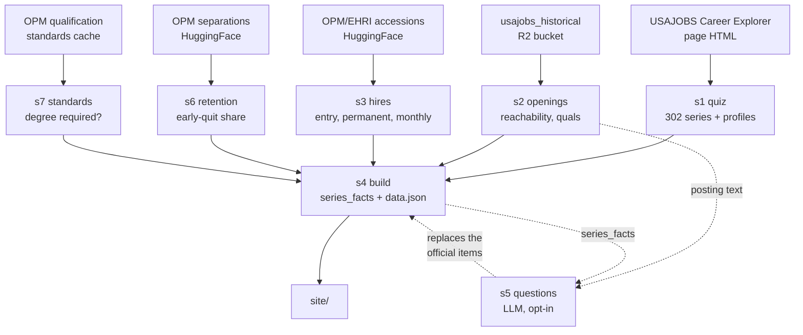

# USAJOBS Career Explorer, rebuilt

A federal career-interest quiz that also tells you what each occupation hires,
what is open to the public right now, what you need to qualify, and how long
people stay.

Live at [usajobs-career-explorer.abigailhaddad.com](https://usajobs-career-explorer.abigailhaddad.com).

Not affiliated with USAJOBS or OPM. The official tool is at
[usajobs.gov/careerexplorer](https://www.usajobs.gov/careerexplorer/).

## Run it

```bash
python run.py        # rebuild all data (stages 1,2,3,6,7,4); writes data/CHANGES.md
python serve.py      # open the quiz at http://localhost:8899
```

Stage 5 is opt-in because it makes LLM calls — `python run.py --stages 5`.
Responses are cached in `data/.llm_cache`, so re-running is free and
deterministic; a full uncached run is about $0.35.

Two paths point outside the repo. Stage 7 reads OPM's qualification standards
from a sibling checkout, `~/Documents/repos/opm-educ-req/cache`
(`STANDARDS_CACHE` in `pipeline/config.py`). Stage 5 reads its OpenAI key from
`env_file` in `pipeline/questions_config.yaml`. Neither is bundled here.

## The pipeline



Stages 6 and 7 run before 4 because the fact table folds both in. A stage that
fails keeps its previous output and the run exits non-zero — `CHANGES.md` says
which tables are stale rather than letting a silent failure read as "no
changes". `data/.prev` holds the previous run's tables so that diff can happen.

## The quiz

Everything is client-side. The page embeds the questions and 302 series, each
with a profile vector. Scoring: z-score the answers, Pearson-correlate against
each profile, sort. No API, no auth.

The 302 series come from the official tool and cover 93% of 2021–2025
accessions, but only 26% of Pathways accessions — 75% of Pathways hires land in
`__99` student-trainee series that have no profile.

## Where the numbers on a card come from

Hires are OPM/EHRI accessions, 2021 onward, from the
`impactproject/opm-ehri-data` dataset on HuggingFace. Entry grade means grades
01–09 on GS-like pay plans plus wage-grade trades; permanent means tenure
groups 1–2. On banded pay plans a low number means senior, so those are
excluded from the entry-level test rather than counted as junior.

Openings come from the `usajobs_historical` R2 bucket. "Reachable" means the
hiring path includes the public, students, or recent graduates — not the
fed-internal paths that require already being a federal employee. One
announcement can carry hundreds of openings, so the counts are openings and
hires, never announcements.

Retention is OPM separations with length of service: per occupation, the share
of exits that are voluntary quits inside two years. It's a share of
separations, not a hazard rate, so an old workforce scores well for reasons
that have nothing to do with new hires.

Whether a job needs a degree is the union of four sources — posting text, OPM's
published standard, what entry hires held, what any-grade hires held. No single
one survives on its own: postings only restate requirements sometimes, OPM's
standards are pointers a parser can't always follow, and about 6% of the
education field is miscoded. That lands at 88 degree · 209 none · 4 credential
· 1 unknown. The credential band exists because a practical nurse qualifies on
a diploma — 9% hold a bachelor's, 87% some college — and "no degree needed" was
the wrong answer for that job.

## Stage 5: writing questions that separate the jobs

The live instrument is generated rather than copied from the official tool. The
hard part isn't writing plausible questions; it's writing ones where different
occupations get different answers. An item everyone scores a 3 on carries no
information, and two items that correlate at 0.9 are one item charged twice.

Everything below is measured, not asserted. The model never gets asked whether
its questions are good.

### Targets

Optimising separation across all 302 series is wasted effort when 76 of them
have nothing open. The target set is series with at least 250 permanent
entry-grade hires since 2021, excluding `never_reachable` and `dormant` status,
capped at the 200 biggest.

### Generate

Candidate items are drawn from five axes chosen because they separate federal
work: who you deal with all day, where the work physically happens, what
passing through the door requires, rhythm and stakes, and what a wrong call
costs.

Each generation call sees 25 real occupations described by their actual posting
titles, qualification facts (degree/licence/clearance/age-limit percentages),
hires per year, and two verbatim announcement summaries. That grounding is the
point — rating from job titles alone produces one model's impression of federal
work, validated against itself.

Items are phrased as descriptions of the activity in the imperative, never as
"would you rather" or any question form, because the respondent is rating how
interested they are in doing the work.

### Rate

Every target occupation is scored against every candidate on 0–4, same
grounding. Missing cells are filled with the item's column mean; more than 25%
missing raises rather than quietly averaging a hole.

### Score

Profiles are z-scored across items, then correlated occupation-to-occupation.
Take the 30 biggest hirers and average the off-diagonal similarity — lower
means the instrument tells them apart. Pairs above 0.80 get reported as
unresolvable twins. The objective is that mean similarity plus 0.02 per twin,
lower being better.

That threshold is calibrated, not guessed. Four enforcement/compliance
occupations sat at 0.85–0.91 instrument similarity while sharing only 0.02–0.09
of their posting language — genuinely different jobs being collapsed. A 0.93
threshold reported zero problems and missed all four.

### The coverage floor

Separation alone is gameable, and it got gamed. A 6-item instrument scored
better than the 21-item one while collapsing 5,000 simulated takers onto 32
possible top matches. Perfect separation of occupations, useless to people.

So coverage is a constraint rather than another weight. Simulate 3,000 random
respondents, take each one's top match, and compute the effective number of
distinct recommendations — the exponential of the entropy, not the max share,
which was too blunt to notice a 156 → 32 collapse. An item set that loses more
than 5% of that against the full candidate set scores infinity.

It was a weighted term first. The objective gamed it twice, and a weight that
needs retuning after every game is the wrong tool. A floor can't be traded
away.

### Prune

Drop items whose hiring-weighted variance is under 0.35, then drop one of any
pair correlated above 0.80, keeping the higher-variance one. Then put back the
best item from any axis the pruner emptied, or whole dimensions disappear.

### Best of N, then residuals

Rating is stable run to run — 94.9% of cells identical, objective moves 0.013.
Generation isn't: 0.084. The fix isn't suppressing that but drawing three
independent instruments and keeping whichever measures best. Caching then locks
in the winner instead of locking in whatever came out first.

Two residual rounds follow. Rather than showing the model more occupations, show
it the pairs it still can't separate and ask for six items that split those
specific pairs. A round is kept only if the objective improves, so a round that
doesn't help costs money but can't damage the instrument.

Finally every one of the 302 series is rated against the kept items, not just
the 200 targets. A series with no profile can never appear in anyone's results.

### The live instrument

25 items: 14 narrow ones from the process above, plus 11 broad ones written
from twelve work families derived in `instrument/llm_families.py`. Narrow items
alone left three of the twelve families with nothing to express interest on;
the mix leaves one. The broad items make measured similarity worse by design and the
trade is worth it — ties among the big hirers fell from 20–22 to 5–9, and
reachable recommendations rose from 142–156 to 210–211.

`instrument/` holds that lineage: family derivation, the broad-item build, and
the promotion scripts that re-rate an edited item set and refuse it unless it
lands inside the measured band. `s4_build` picks up `mixed_questions.parquet`
if it exists, falls back to stage 5's own output, and falls back again to OPM's
32 items if stage 5 never ran.
