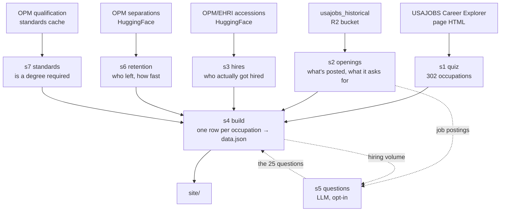

# USAJOBS Career Explorer, rebuilt

A federal career quiz. You answer 25 questions about what kind of work you'd
want to do, and you get occupations ranked by fit — each one showing how many
people it hired at entry level in the last year, how many jobs are open to the
public right now, and what you'd need to qualify.

Live at [usajobs-career-explorer.abigailhaddad.com](https://usajobs-career-explorer.abigailhaddad.com).

Not affiliated with USAJOBS or OPM. The official tool is at
[usajobs.gov/careerexplorer](https://www.usajobs.gov/careerexplorer/).

## Run it

```bash
python run.py        # rebuild all data (stages 1,2,3,6,7,4); writes data/CHANGES.md
python serve.py      # open the quiz at http://localhost:8899
```

Stage 5 writes the questions and is opt-in, because it calls an LLM:
`python run.py --stages 5`. Responses are cached in `data/.llm_cache`, so
re-running costs nothing; a full uncached run is about $0.35.

Two paths point outside the repo. Stage 7 reads OPM's qualification standards
from a sibling checkout, `~/Documents/repos/opm-educ-req/cache`
(`STANDARDS_CACHE` in `pipeline/config.py`). Stage 5 reads its OpenAI key from
`env_file` in `pipeline/questions_config.yaml`.

## The pipeline



Stages 6 and 7 run before 4 because stage 4 folds them into one table. If a
stage fails it keeps its previous output and the run exits non-zero, and
`CHANGES.md` says which tables are stale — otherwise a broken fetch reads as "no
changes" and nothing looks wrong.

## How the scoring works

The whole quiz runs in the browser. The page ships with the 25 questions and,
for each of 302 occupations, a list of 25 numbers saying how central each kind
of work is to that job.

Your answers become a list of 25 numbers too. Both lists get standardized, then
correlated. High correlation means the shape of what you said you wanted matches
the shape of that job. Sort descending, show the top 15.

The 302 occupations come from the official tool. They cover 93% of federal hires
since 2021, but almost none of the Pathways student and intern hiring — three
quarters of that lands in student-trainee occupations that the official tool
never gave a profile to, so this one can't rank them either.

## The numbers on each result card

**Hires** are OPM/EHRI accessions from 2021 on, via the
`impactproject/opm-ehri-data` dataset on HuggingFace. Entry level means grades
01–09 on GS-style pay plans, plus wage-grade trades. Permanent means tenure
groups 1 and 2. Banded pay plans are excluded from the entry-level test rather
than counted, because on those a low number means senior — counting them would
turn executives into entry-level hires.

**Openings** come from the `usajobs_historical` R2 bucket, counting only
postings the public, students, or recent graduates can apply to — not the ones
restricted to current federal employees. The card counts openings and hires,
never announcements, because a single announcement can carry hundreds of jobs.

**Retention** is the share of people leaving an occupation who quit voluntarily
within two years. It's a share of departures, not a rate, so an occupation with
an older workforce looks good for reasons that have nothing to do with how new
hires are treated.

**Whether you need a degree** comes from four sources combined: the posting
text, OPM's published standard, what entry-level hires held, and what hires at
any grade held. None of them works alone — postings often don't restate the
requirement, OPM's standards are pointers a parser can't always follow, and
about 6% of the education field is miscoded. The result is 88 occupations
needing a degree, 209 not, 4 needing a credential, 1 unknown.

That credential category exists because of practical nurses. Only 9% hold a
bachelor's, so the data says no degree needed, but 87% have some college and you
can't do the job without an LPN diploma. "No degree needed" was the wrong answer.

## Writing the questions

### The problem

An interest quiz is only useful if different jobs produce different answers. The
official one mostly doesn't. Score its 32 questions against the 30 biggest
entry-level hirers and they come out at 0.19 average similarity to each other —
and some pairs are worse than that. Criminal investigator and customs
interdiction officer sit at 0.99, essentially the same job as far as the
questions can tell, even though one hires thousands of people and the other
hires almost none. When two occupations score the same, which one you're shown
first is a coin flip.

So stage 5 writes its own questions and checks whether they do better.

### How we tell whether a question set is working

Every occupation gets rated 0 to 4 on every question — 0 if that kind of work
isn't part of the job, 4 if it's the core of it. Those ratings are the
occupation's profile.

Then compare profiles. Take the 30 biggest entry-level hirers, correlate every
pair, and average. A low average means the questions pull those jobs apart. Any
pair above 0.80 gets flagged as a tie the quiz can't break. The score being
optimized is that average, plus a penalty of 0.02 per tie.

The 0.80 cutoff is calibrated rather than picked. Four enforcement and
compliance occupations were sitting at 0.85–0.91 similarity while their job
postings shared only 2–9% of their language — clearly different jobs getting
collapsed. A cutoff of 0.93 reported no problems at all and missed every one of
them.

The ratings are grounded in real postings, not job titles: each occupation is
described to the model with its actual posting titles, its degree, license,
clearance and age-limit percentages, its hiring volume, and two real
announcement summaries. Rating from titles alone would produce one model's
impression of federal work, checked against itself.

### The catch: a short question set cheats this measure

Optimizing for separation alone breaks in an obvious way once you see it. A
6-question version scored better than the 21-question one — and funneled
thousands of simulated quiz-takers onto just 32 possible top matches. It told
the occupations apart beautifully and told the people apart not at all.

So variety is a hard requirement, not another thing to trade off. Simulate 3,000
random takers, see which occupation each one lands on first, and count how many
distinct answers come out (using the exponential of the entropy — a plain "what
share got the most common answer" was too crude to notice the drop from 156
recommendations down to 32). A question set that gives up more than 5% of that
variety scores as infinitely bad and is thrown out.

This started as a weighted term in the score. The optimizer gamed it twice, and
a weight that needs retuning every time it gets gamed isn't doing its job. A
floor can't be traded away.

### Three smaller problems

**The model writes different questions every run.** Re-rating the same questions
is stable — 94.9% of the ratings come out identical, and the score moves 0.013.
Generating new questions moves it 0.084. So stage 5 generates three separate
sets, scores all three, and keeps the best. Caching then locks in the winner
instead of whatever came out first.

**Some pairs stay tied.** After picking a set, the remaining tied pairs go back
to the model with a request for questions that would split those specific pairs.
This happens twice, and a round is kept only if the score improves, so a round
that doesn't help wastes money but can't make things worse.

**Dead and duplicate questions.** A question everyone answers the same carries no
information, and two questions that correlate at 0.9 are one question counted
twice. So: drop anything whose variance across occupations (weighted by hiring
volume) is under 0.35, then drop one of any pair correlated above 0.80, keeping
whichever discriminates more. One exception — if pruning empties out a whole
category of question, the best one from that category goes back in.

Finally, all 302 occupations get rated on the surviving questions, not just the
175 big hirers used for tuning. An occupation with no profile can never show up
in anyone's results.

### What the site ended up with

25 questions: 14 specific ones from the process above, plus 11 broader ones.

The broader ones exist because specific questions have a blind spot. They're
written to separate particular jobs, so they can cover the biggest hirers well
and still leave whole kinds of work with nothing for a person to react to. Of
twelve work families, three had no question that spoke to them at all. Adding
broad questions brings that down to one.

The broad questions make the raw similarity number worse, which is the expected
trade. Everything else improved: ties among the big hirers dropped from around
20 to around 7, and the number of occupations that can come up as someone's top
match went from roughly 150 to 210.

`instrument/` holds the scripts behind that final set — deriving the work
families, writing the broad questions, and re-rating an edited question set,
which refuses the edit unless the numbers stay in the measured band. `s4_build`
uses `mixed_questions.parquet` if it's there, falls back to stage 5's own
output, and falls back again to the official 32 questions if stage 5 never ran.
